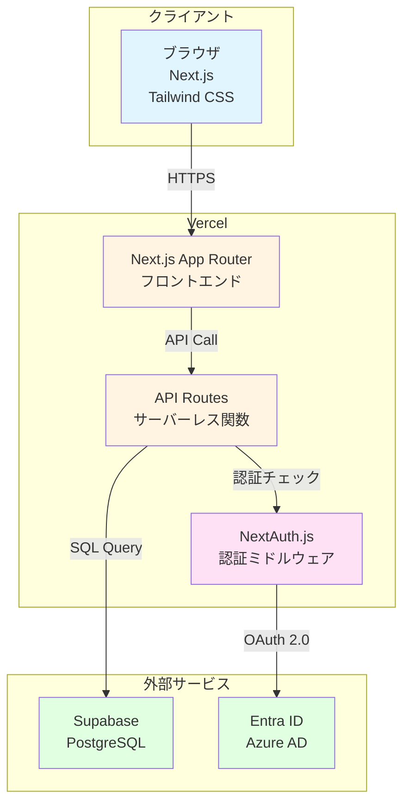

# アーキテクチャ設計

## 技術スタック
- フロントエンド: Next.js 14 (App Router) + Tailwind CSS + shadcn/ui
- バックエンド: Next.js API Routes (サーバーレス関数)
- データベース: Supabase (PostgreSQL)
- 認証: NextAuth.js v5 (Entra ID / Azure AD連携)
- インフラ: Vercel (フロントエンド + API) + Supabase (DB)
- その他: React Query (データフェッチング), Zod (バリデーション)

## システム構成図

## 選択理由
- **Next.js 14 (App Router)**:
  - フロントエンドとバックエンドを統合開発可能
  - サーバーコンポーネントによる高速化
  - ファイルベースルーティングで開発効率が高い
  - 要件に明記されている技術スタック

- **Tailwind CSS + shadcn/ui**:
  - ユーティリティファーストで開発速度が速い
  - shadcn/uiでアクセシブルなUIコンポーネントを簡単に実装
  - カスタマイズ性が高く、デザインシステムの構築が容易
  - 要件に明記されている技術スタック

- **Next.js API Routes**:
  - フロントエンドと同じリポジトリで管理可能
  - サーバーレスなので運用コストが低い
  - Vercelにデプロイするだけで自動スケール
  - 個人開発に最適

- **Supabase (PostgreSQL)**:
  - 無料枠が大きい（500MB DB、50,000 月間アクティブユーザー）
  - PostgreSQL標準で信頼性が高い
  - リアルタイム機能、Row Level Security (RLS) 標準搭載
  - バックアップ・スケーリングが自動
  - 管理画面が使いやすい

- **NextAuth.js v5 (Entra ID連携)**:
  - 企業向けにEntra ID (旧Azure AD) との連携が必須
  - Next.js 14 App Routerに完全対応
  - OAuth 2.0 / OpenID Connect標準サポート
  - セッション管理が簡単

- **Vercel**:
  - Next.jsの開発元で最適化されている
  - 無料枠が十分（Hobby: 100GB帯域/月）
  - GitHubと連携してCI/CD自動化
  - プレビューデプロイが自動生成
  - エッジファンクションで高速レスポンス

- **React Query**:
  - サーバーステートの管理が簡単
  - キャッシング、リトライ、バックグラウンド更新が自動
  - ローディング・エラー状態の管理が統一的

- **Zod**:
  - TypeScript完全統合のスキーマバリデーション
  - APIリクエスト・レスポンスの型安全性確保
  - フォームバリデーションとの統合が容易

## 初期コスト（月額）
- **Vercel (Hobby)**: $0（無料枠内で十分）
  - 帯域: 100GB/月
  - ビルド時間: 6000分/月
  - サーバーレス関数実行: 100GB-時間/月

- **Supabase (Free)**: $0（無料枠内で十分）
  - DB容量: 500MB
  - 帯域: 5GB/月
  - 月間アクティブユーザー: 50,000人

- **Entra ID (Microsoft 365)**: $0
  - 企業で既に契約しているものを利用

- **合計**: $0/月（PoC段階、~1000ユーザーまで無料枠内）

## スケーリング時のコスト（将来）
もし無料枠を超えた場合:
- **Vercel Pro**: $20/月（より大きな帯域・ビルド時間）
- **Supabase Pro**: $25/月（8GB DB、250GB帯域）
- **合計**: $45/月（1000人超の本格運用時）

## セキュリティ考慮事項
- **認証**: NextAuth.js + Entra IDで企業SSO
- **認可**: ミドルウェアでロール確認（一般ユーザー/教育担当/管理者）
- **データアクセス**: Supabase RLS（Row Level Security）で行レベル制御
- **API保護**: API Routesで認証トークン検証
- **HTTPS**: Vercel標準で全通信暗号化
- **環境変数**: Vercel環境変数で秘匿情報管理

## 開発環境
- **ローカル開発**:
  - Node.js 20+
  - pnpm (パッケージマネージャ)
  - Supabase Local Development (Docker)

- **CI/CD**:
  - GitHub ActionsでLint/Test自動化
  - Vercel GitHubインテグレーションで自動デプロイ

- **コード品質**:
  - ESLint + Prettier
  - TypeScript strict mode
  - Husky (pre-commit hooks)
