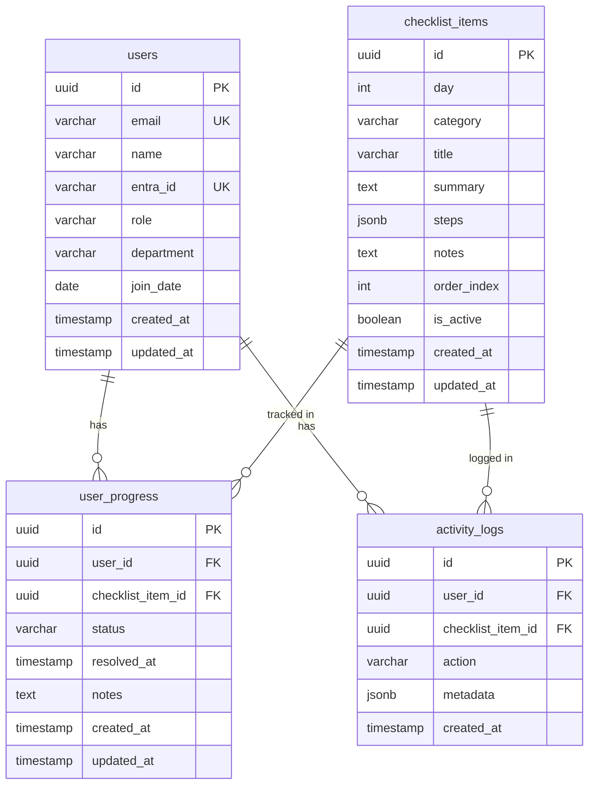

# データベース設計

## テーブル一覧
- **users**: ユーザー情報（新入社員・教育担当・管理者）
- **checklist_items**: チェックリスト項目マスタ（Day1-3の各設定手順）
- **user_progress**: ユーザーごとのチェックリスト進捗状態
- **activity_logs**: 利用ログ（閲覧・解決・未解決・問い合わせ等の行動記録）

## 主要テーブル DDL

### users テーブル
```sql
CREATE TABLE users (
  id UUID PRIMARY KEY DEFAULT gen_random_uuid(),
  email VARCHAR(255) UNIQUE NOT NULL,
  name VARCHAR(100) NOT NULL,
  entra_id VARCHAR(255) UNIQUE NOT NULL, -- Entra ID (Azure AD) のユーザーID
  role VARCHAR(20) NOT NULL DEFAULT 'user', -- 'user', 'trainer', 'admin'
  department VARCHAR(100),
  join_date DATE, -- 入社日
  created_at TIMESTAMP WITH TIME ZONE DEFAULT NOW(),
  updated_at TIMESTAMP WITH TIME ZONE DEFAULT NOW()
);

-- インデックス
CREATE INDEX idx_users_email ON users(email);
CREATE INDEX idx_users_entra_id ON users(entra_id);
CREATE INDEX idx_users_role ON users(role);
```

### checklist_items テーブル
```sql
CREATE TABLE checklist_items (
  id UUID PRIMARY KEY DEFAULT gen_random_uuid(),
  day INT NOT NULL, -- 1, 2, 3 (Day1-3)
  category VARCHAR(50) NOT NULL, -- 'login', 'm365', 'teams', 'iphone', 'vpn', etc.
  title VARCHAR(200) NOT NULL, -- 項目タイトル
  summary TEXT NOT NULL, -- 結論（概要）
  steps JSONB NOT NULL, -- 手順（配列形式）
  notes TEXT, -- 注意点
  order_index INT NOT NULL, -- 表示順序
  is_active BOOLEAN DEFAULT TRUE, -- 有効/無効
  created_at TIMESTAMP WITH TIME ZONE DEFAULT NOW(),
  updated_at TIMESTAMP WITH TIME ZONE DEFAULT NOW()
);

-- インデックス
CREATE INDEX idx_checklist_items_day ON checklist_items(day);
CREATE INDEX idx_checklist_items_category ON checklist_items(category);
CREATE INDEX idx_checklist_items_order ON checklist_items(day, order_index);

-- steps カラムのJSONB例:
-- {
--   "steps": [
--     "1. Windowsにログインする",
--     "2. Ctrl + Alt + Del を押す",
--     "3. パスワードを入力する"
--   ]
-- }
```

### user_progress テーブル
```sql
CREATE TABLE user_progress (
  id UUID PRIMARY KEY DEFAULT gen_random_uuid(),
  user_id UUID NOT NULL REFERENCES users(id) ON DELETE CASCADE,
  checklist_item_id UUID NOT NULL REFERENCES checklist_items(id) ON DELETE CASCADE,
  status VARCHAR(20) NOT NULL DEFAULT 'pending', -- 'pending', 'resolved', 'unresolved'
  resolved_at TIMESTAMP WITH TIME ZONE, -- 解決した日時
  notes TEXT, -- ユーザーのメモ
  created_at TIMESTAMP WITH TIME ZONE DEFAULT NOW(),
  updated_at TIMESTAMP WITH TIME ZONE DEFAULT NOW(),

  UNIQUE(user_id, checklist_item_id) -- 同じユーザー・項目の組み合わせは1つだけ
);

-- インデックス
CREATE INDEX idx_user_progress_user_id ON user_progress(user_id);
CREATE INDEX idx_user_progress_status ON user_progress(status);
CREATE INDEX idx_user_progress_user_status ON user_progress(user_id, status);
```

### activity_logs テーブル
```sql
CREATE TABLE activity_logs (
  id UUID PRIMARY KEY DEFAULT gen_random_uuid(),
  user_id UUID NOT NULL REFERENCES users(id) ON DELETE CASCADE,
  checklist_item_id UUID REFERENCES checklist_items(id) ON DELETE SET NULL,
  action VARCHAR(50) NOT NULL, -- 'view', 'resolve', 'unresolve', 'contact_click', 'share_link'
  metadata JSONB, -- 追加情報（どのリンクをクリックしたか等）
  created_at TIMESTAMP WITH TIME ZONE DEFAULT NOW()
);

-- インデックス
CREATE INDEX idx_activity_logs_user_id ON activity_logs(user_id);
CREATE INDEX idx_activity_logs_action ON activity_logs(action);
CREATE INDEX idx_activity_logs_created_at ON activity_logs(created_at DESC);
CREATE INDEX idx_activity_logs_user_action ON activity_logs(user_id, action);

-- metadata カラムのJSONB例:
-- {
--   "link_type": "teams_chat",
--   "contact_method": "form"
-- }
```

## リレーション
- **users.id** → **user_progress.user_id** (1対多: 1人のユーザーは複数の進捗を持つ)
- **users.id** → **activity_logs.user_id** (1対多: 1人のユーザーは複数のログを持つ)
- **checklist_items.id** → **user_progress.checklist_item_id** (1対多: 1つの項目は複数ユーザーの進捗を持つ)
- **checklist_items.id** → **activity_logs.checklist_item_id** (1対多: 1つの項目は複数のログを持つ)

## ER図


## 初期データ例

### Day1のチェックリスト項目例
```sql
INSERT INTO checklist_items (day, category, title, summary, steps, notes, order_index) VALUES
(1, 'login', 'Windowsログイン', 'Windows PCに初回ログインする',
 '["1. PCの電源を入れる", "2. Ctrl + Alt + Del を押す", "3. 配布されたユーザーID・パスワードを入力", "4. 言語設定を日本語に変更"]',
 'パスワードは初回ログイン後に変更してください', 1),

(1, 'm365', 'Microsoft 365 初期設定', 'M365アカウントにログインし、基本設定を完了する',
 '["1. ブラウザでoffice.comにアクセス", "2. 配布されたメールアドレスでログイン", "3. 多要素認証（MFA）を設定", "4. OneDriveの同期設定"]',
 'MFAは必ず設定してください（セキュリティポリシー）', 2),

(1, 'teams', 'Microsoft Teams セットアップ', 'Teamsアプリをインストールして初期設定する',
 '["1. Teamsアプリをダウンロード", "2. M365アカウントでサインイン", "3. 通知設定を確認", "4. プロフィール写真を設定"]',
 '通知設定は後から変更できます', 3);
```

## Row Level Security (RLS) ポリシー例
Supabaseで行レベルのアクセス制御を実装:

```sql
-- users テーブル: 自分の情報のみ閲覧・更新可能
ALTER TABLE users ENABLE ROW LEVEL SECURITY;

CREATE POLICY "Users can view own data"
  ON users FOR SELECT
  USING (auth.uid()::text = entra_id);

CREATE POLICY "Users can update own data"
  ON users FOR UPDATE
  USING (auth.uid()::text = entra_id);

-- user_progress テーブル: 自分の進捗のみ閲覧・更新可能
ALTER TABLE user_progress ENABLE ROW LEVEL SECURITY;

CREATE POLICY "Users can view own progress"
  ON user_progress FOR SELECT
  USING (user_id IN (SELECT id FROM users WHERE entra_id = auth.uid()::text));

CREATE POLICY "Users can update own progress"
  ON user_progress FOR UPDATE
  USING (user_id IN (SELECT id FROM users WHERE entra_id = auth.uid()::text));

-- activity_logs テーブル: 自分のログのみ作成可能
ALTER TABLE activity_logs ENABLE ROW LEVEL SECURITY;

CREATE POLICY "Users can create own logs"
  ON activity_logs FOR INSERT
  WITH CHECK (user_id IN (SELECT id FROM users WHERE entra_id = auth.uid()::text));

-- checklist_items テーブル: 全員が閲覧可能
ALTER TABLE checklist_items ENABLE ROW LEVEL SECURITY;

CREATE POLICY "Anyone can view checklist items"
  ON checklist_items FOR SELECT
  TO authenticated
  USING (is_active = true);
```

## データマイグレーション方針
- Supabase Migrationsを使用
- バージョン管理: `/supabase/migrations/` にSQLファイルを配置
- 初期データ投入: seed.sqlで管理
- ロールバック可能な設計

## パフォーマンス最適化
- **インデックス**: 頻繁に検索されるカラムにインデックス作成済み
- **JSONB**: 手順データはJSONBで柔軟性を確保しつつ、GINインデックスで高速検索可能
- **パーティショニング**: activity_logsは将来的に日付でパーティション分割を検討
- **キャッシング**: フロントエンドでReact Queryによるクライアント側キャッシュ
